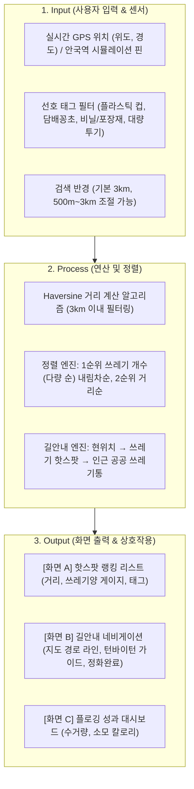

# [구현 계획서] 안국역 플로깅 무단 쓰레기 핫스팟 랭킹 및 길안내 시스템

사용자의 실시간 GPS 위치와 선호 태그를 기반으로 반경 3km 내 무단 쓰레기 배출 장소(폐기물 5개 이상)를 탐색하고, **쓰레기 다량 순으로 정렬된 리스트**와 **목적지까지의 인터랙티브 길안내(경로 안내 및 분리수거함 연계) 화면**을 제공하는 웹 애플리케이션 구현 계획입니다.

---

## 1. 시스템 구조 및 I/O 명세 (System Architecture)



---

## 2. 세부 구현 기능 및 화면 설계

### [화면 1] 메인 대시보드 & 핫스팟 랭킹 리스트
1. **상단 컨트롤 바**:
   * 실시간 GPS 위치 획득 버튼 (`navigator.geolocation`) 및 안국역 주요 지점(안국역 1~6번 출구, 헌법재판소, 북촌마을 등) 빠른 선택기
   * 선호 태그 토글 칩: `#일회용컵`, `#담배꽁초`, `#비닐/포장재`, `#음식물/배달용기`, `#10개이상_심각`
   * 정렬 기준 전환: **`쓰레기 많은 순 (기본)`** / `가까운 거리 순`
2. **핫스팟 랭킹 리스트 카드**:
   * 순위 뱃지 (TOP 1, TOP 2, ...) 및 쓰레기 개수 시각 게이지
   * 현재 위치로부터의 실시간 거리 (예: `240m`, `1.2km`)
   * 쓰레기 종류 태그 및 현장 사진 미리보기
   * **[길안내 시작 🧭]** 원클릭 인터랙션 버튼

### [화면 2] 인터랙티브 지도 & 실시간 길안내 (Navigation Mode)
1. **지도 뷰 (Leaflet.js + OpenStreetMap 기반 고화질 커스텀 렌더러)**:
   * 사용자 현 위치 펄스(Pulse) 마커
   * 안국역 일대 3km 반경 서클 오버레이
   * 쓰레기 핫스팟 마커 (밀집도에 따라 색상 차등: Red 15개+, Orange 10개+, Yellow 5개+)
   * 종로구 공공 쓰레기통/클린하우스 마커 (Green 핀)
2. **스마트 길안내 (Route Guidance)**:
   * 사용자 현 위치 ➔ 선택한 쓰레기 핫스팟 ➔ 가장 가까운 종로구 공공 쓰레기통까지의 **2단계 최적 동선 폴리라인(Polyline)** 시각화
   * 실시간 남은 거리 / 예상 도보 시간 / 권장 수거 가이드 표시
   * **[정화 완료 인증 📸]** 버튼 ➔ 정화 완료 시 해당 핫스팟 상태 갱신 및 플로깅 마일리지 적립

---

## 3. 파일 및 컴포넌트 구성 계획

### Proposed Changes

#### [NEW] [index.html](file:///c:/Users/User/Desktop/슬기로운%20AI생활/index.html)
- 시맨틱 마크업 기반의 반응형 대시보드 구조 (모바일 & 데스크톱 듀얼 뷰 지원)
- 리스트 패널과 풀스크린 인터랙티브 지도 영역 구성

#### [NEW] [style.css](file:///c:/Users/User/Desktop/슬기로운%20AI생활/style.css)
- 모던 글래스모피즘(Glassmorphism) 및 친환경 에코 다크/라이트 테마
- 부드러운 트랜지션, 핫스팟 랭킹 카드 애니메이션, 실시간 길안내 HUD 스타일

#### [NEW] [data/anguk_spots.js](file:///c:/Users/User/Desktop/슬기로운%20AI생활/data/anguk_spots.js)
- 안국역 일대 반경 3km 내 실제 지리 기반의 무단 쓰레기 배출 핫스팟 데이터셋 (5개 이상 밀집지)
- 종로구 공공 쓰레기통 및 클린하우스 지리 좌표 데이터셋

#### [NEW] [app.js](file:///c:/Users/User/Desktop/슬기로운%20AI생활/app.js)
- **위치 엔진**: Geolocation API 연동 및 Haversine 거리 계산
- **필터 & 정렬 엔진**: 3km 반경 필터, 태그 필터, `trash_count` 내림차순 정렬 로직
- **지도 & 길안내 엔진**: Leaflet 지도 초기화, 마커 렌더링, 경로 생성, 길안내 모드 전환
- **플로깅 세션 관리**: 수거 완료 처리 및 로컬 스토리지 연동

---

## 4. 데이터 스키마 (JSON Example)

```javascript
// data/anguk_spots.js 예시
export const ANGUK_TRASH_SPOTS = [
  {
    id: "SP-01",
    name: "안국역 3번 출구 계동길 진입로 화단",
    lat: 37.5772,
    lng: 126.9858,
    trashCount: 24, // 5개 이상
    types: ["플라스틱 컵", "담배꽁초", "비닐봉지"],
    description: "테이크아웃 컵과 담배꽁초가 화단 틈새에 집중 방치됨",
    status: "active" // active | cleaned
  },
  {
    id: "SP-02",
    name: "헌법재판소 맞은편 골목 배전함 뒤",
    lat: 37.5788,
    lng: 126.9842,
    trashCount: 18,
    types: ["일회용품", "포장용지", "플라스틱 컵"],
    description: "골목 사각지대에 관광객 배출 쓰레기 밀집",
    status: "active"
  }
];
```

---

## 5. 검증 계획 (Verification Plan)

### 기능 검증
1. **거리 계산 및 3km 필터링 정확도**:
   * 안국역 1번~6번 출구 등 다양한 기준점에서 거리(m)가 오차 없이 계산되는지 확인
2. **쓰레기 다량 순 정렬**:
   * 쓰레기 개수(`trashCount`)가 큰 순서대로 리스트가 상단에 올바르게 배치되는지 검증
3. **태그 필터 연동**:
   * 태그(예: `#플라스틱 컵`) 클릭 시 해당 쓰레기가 포함된 핫스팟만 즉각 재정렬되는지 확인
4. **길안내(Navigation) 동작**:
   * 리스트에서 `길안내 시작` 클릭 시 지도가 해당 핫스팟으로 포커싱되고, 출발지 → 쓰레기 스팟 → 인근 쓰레기통 경로가 올바르게 그려지는지 검증
